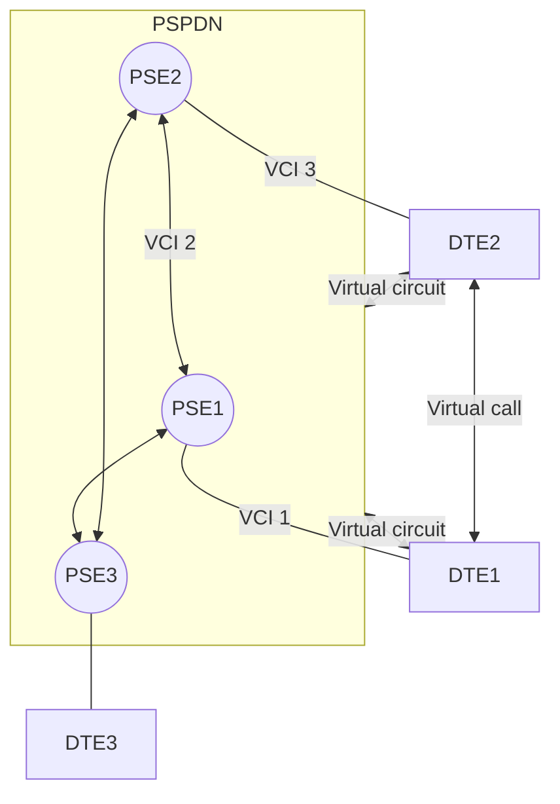
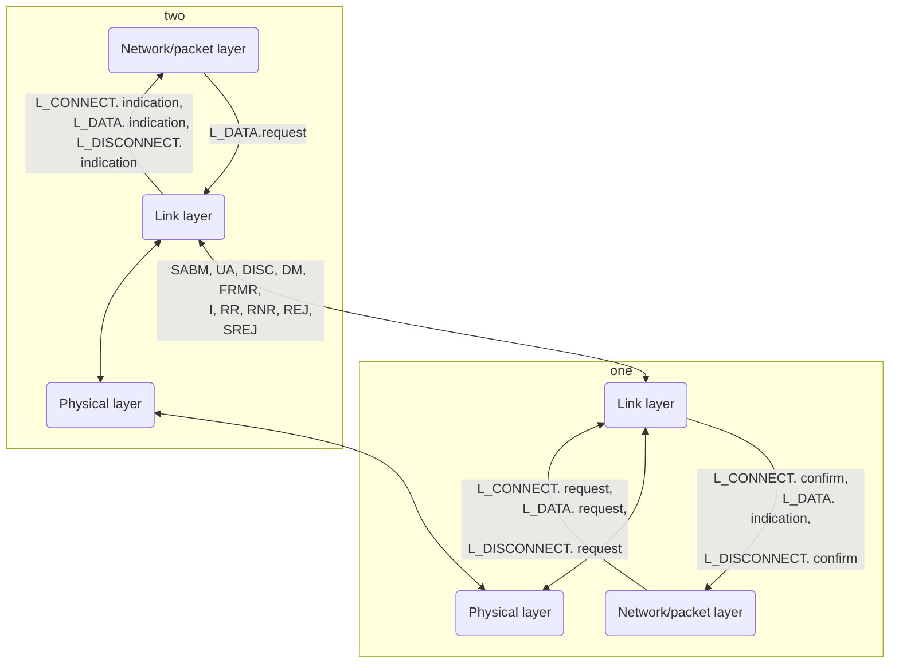

## Notes
#### Introduction
In contrast with Public Switched Telephone Networks, which support only a modest user data rate (9600bps), and which are charged on a time * distance basis, this chapter is about Wide Area Networks, which include both public data networks and enterprisewide private data networks.

#### 8.1 Characteristics of public data networks
[[Abbreviations#PDN|PDN]] - **public data network** - created and maintained by a (national) authority specifically for transmitting data. 
Two main types of PDN - packet switched ([[Abbreviations#PSPDN|PSPDN]]) and circuit switched ([[Abbreviations#CSPDN|CSPDN]]). The standards for interoperating between PDN equipment made by different manufacturers for each of these types of networks refers to the lower three layers of the ISO reference model (Network, Link, and Physical layers). The characteristics of these lower layers are made transparent to the higher layers by the transport layer (fourth layer), which offers the higher layers a network-independent message transport service.

##### 8.1.1 Circuit and packet switching
Circuit switched networks create a physical communication channel, set up through the network from the calling to the called subscriber equipment. This connection is then used exclusively by the two subscribers for the duration of the call. All telephone connections are of the circuit switched type ([[TODO]]: Still?)
Circuit-switched connections provide a fixed data rate channel - both subscribers must operate at that rate. Also, before any data can be transmitted, a connection must be set up via the network. Currently, the time to set up a call through the PSTN (telephone network) can be relatively long - tens of seconds - owing to the type of equipment used for the exchange. However, this time is getting shorter (tens of milliseconds, sometimes) because of a) widespread introduction of computer-controller switching exchanges, and b) adoption of digital transmission through the network . Also - the extension of digital transmission to the subscribers equipment means that a high bit rate (64kbps or higher) switched transmission path will be available to the subscriber. This path can then be used for transmitting data without using modems. The resulting digital PSTN can be regarded as a public [[Abbreviations#CSDN|Circuit Switched Data Network]].
Although setting up a connection for an all-digital circuit switched networks is relatively fast, the resulting connection still provides only a path with a fixed data rate ([[TODO]] - why?).

With a packet-switched network, two communicating subscribers (DTEs) can operate at different data rates.  Also, no physical connections are establisted through the network. Instead, the data is first assembled into one or more message units, called packets. These packets include both the source and destination DTE addresses. They are then passed bit serially by the source DTE to its local **packet switching exchange** ([[Abbreviations#PSE|PSE]]). On receipt of each packet, the exchange first stores the packet, then inspects the destination address it contains. Each PSE contains a **routing directory** specifying the outgoing link(s) (transmission path(s)) to be used for each network address. The PSE forwards the packet on the appropriate link at the maximum available bit rate. This mode of working is called **packet store-and-forward**.
As each packet is received (and stored) at each PSE along the route, it is forwarded interspersed with other packets being forwarded on that link.
Each transaction only occupies a (random) portion of the available bandwidth on each link, since packets are interspersed with packets from other sources. The available bandwidth will range from zero (user is not transmitting any data) to the full bandwidth, if it is transmitting packets continuously.
A number of packets may arrive simultaneously at a PSE (on different incoming links) and each may require forwarding to the same outgoing link. If a number of long packets are waiting to be transmitted, other packets may experience unexpectedly long delays. To prevent this, and ensure that the network has a reliably fast transmit time, a **maximum length** is allowed for each packet. Therefore, a message submitted to the transport layer within the DTE may have to first be divided by the source transport layer into smaller packets before transmission. These smaller units are reassembled into a single message by the transport layer at the destination DTE.
Another difference between a CSPDN and a PSPDN is that with a circuit switched data network, the network does not apply any error or flow control on the transmitted data, so this must be performed by the user. With a PSPDN, however, sophisticated error and flow procedures are applied by the network PSEs.

##### Datagrams and virtual circuits
PSPDNs have two types of service: datagram and virtual call (circuit). 
Datagrams are usually used for the transfer of short, single-packet messages.
Virtual calls are analogous to a digital PSTN in that a link is set up between two DTEs. Then, the packets can transfer directly between them. The source DTE sends a **call request** packet to its local PSE containing, in addition to the required physical destination DTE network address, a reference called the virtual circuit identifier ([[Abbreviations#VCI|VCI]]). The PSE notes this VCI, and forwards the (call request) packet as usual. At the destination PSE, a second VCI is assigned to the call request call request packet, before it is forwarded on the outgoing link to the destination DTE. Then, assuming the call is accepted, an appropriate response packet is returned to the calling DTE ([[TODO]]: to confirm that the circuit has been established?). At this point we say that a virtual circuit (VC) exists between the two DTEs. The information transfer phase is then entered, and all subsequent data packets relating to this call are assigned the same reference numbers ([[TODO]] VCI?) on each interface link to the network. Then, both the source and destination DTEs can distinguish between packets arriving on the same link but relating to different calls.
Figure 8.3 (page 428): Virtual call/virtual circuit relationship and packet routing principles: [Mermaid](https://mermaid.live/edit#pako:eNp1kDFvwyAQhf8KuimW4sF4syoPrTNkqSIlysRyBVwjYRwRUBWF_PcAVl23UhkQuu_e493dgU9CQgO9nr74gNaR1xMzJJ7utKtIWZbh_LYnVSCH465aCF1InQldaV4iasNZWedRE45ahyxhZm66-o9Pi5ch6g7d-1xLJ9rUm026iyKZtPnLXKmK4nffwmnm9A_PIdqcj67zSSO-U8REdRoi262Ks5T85FeWe-XCnPY_mOaDLYzSjqhE3Oc9GTJwgxwlgyY-hezRa8eAmUdsRe-m481waJz1cgv-ItDJTmHczQhNj_oqH0_i33Wn)

	Virtual circuit: VCI 1 + VCI 2 + VCI 3
	PSE1 routing tables:
|                    | In             | Out            |
|--------------------|----------------|----------------|
| PSE1 routing table | VCI 1 / Link 1 | VCI 2 / Link 2 |
|                    | VCI 2 / Link 2 | VCI 1 / Link 1 |
| PSE2 routing table | VCI 2 / Link 1 | VCI 3 / Link 2 |
|                    | VCI 3 / Link 2 | VCI 2 / Link 1 |

Note that a virtual call is only a logical connection. Moreover, because PSPDNs provide error+flow controls, the class of service supported by a VC is much higher than that on a circuit switched network.
Normally, a vircuit circuit is cleared, and the appropriate VCIs released, after all data related to a call (ie, all the packets of that data) have been exchanged. However the VC may be left permanently established, so that a user who frequently requires to communnicate with another user does not have to set up a new VC for each call. This is known as a permanent virtual circuit ([[Abbreviations#PVC|PVC]]). 

#### 8.2 Packet Switched data networks
Internationally agreed network access protocol defined to interface a DTE to a PSPDN is X.25 (which is a collection of protocol standards).
There's an important diagram here (page 429) outlining a) how the different parts of X.25 apply to different parts of PSPDNs, and b), defining what connections constitute the different ISO layers in a PSPDN.
Here's a description of a):
DCE-to-DTE: X.21/X.21 bis
PSE-to-DTE via DCE: X.25
PSE-to-PSE: PSPDN
Here's a description of b):
PSE-to-PSE: internal network protocols
DCE to individual DTEs - physical layer
PSE to DTEs via DCE - link layer and packet layer
DTE-to-DTE via the PSEs - transport layer

At the lowest layer (physical - DCE to DTE), the interface standard is called X.21. This interface is also used with digital circuit switched networks. The link layer protocol used with X.25 is a version of the HDLC protocol known as LAPB and its function is a provide the packet layer with an error-free packet transport facility over the physical link between the DTE and its local PSE. Finally, the packet layer is concerned with the reliable transfer of transport layer messages - known as transport protocol data units (TPDUs) - and with the multiplexing of one or more virtual calls - network service access points (NSAPs) - on the single physical link controlled by the link layer. 

##### 8.2.1 Physical layer
The DCE is analogous to a synchronous modem (for telephones), since its function is to provide a full-duplex, bit-serial, synchronous transmission path between the DTE and the local PSE. It can operate at data rates between 600bps and 64kbps.
Figure 8.6 (page 431) titled X.21 physical layer interface circuits:
```
<--------- Subscriber's premises --------> <-------- PSPDN -------->
     |  Transmit (T) >            |       |
     |  Control (C) >             |       | 
DTE  |  < Receive (R)             |  DCE  | <- -> PSE <-> other PSEs
     |  < Indication (I)          |       |
     |  < Signal (bit) timing (S) |       |
```

##### 8.2.2 Link layer
The aim of this layer is to provide the packet layer with a reliable (error free and no duplicates) packet transport facility across the physical link between the DTE and the local PSE. Link layer has no knowledge of the logical channel to which a packet may belong - this is known only by the packet layer. Therefore, the error+flow control procedures used by the link layer apply to all packets irrespective of the virtual circuits to which they belong.
The frame structure and error+flow control procedures used by link layer are based on HDLC protocol (see chapter 5 for basics of HDLC).

The services provided by the link later to the network (packet) layer are summarized in Figure 8.7a (page 432, titled Link layer summary)  [Mermaid](https://mermaid-js.github.io/mermaid-live-editor/edit#pako:eNp1kt9vgjAQx_-Vpk8uqUvoIzFL8McSF2QE3FsT7WgZzaB1pcQY9X9fEVDnoA-XtnfX732ud4SJYhy6MM3VPsmoNmC6JhLYVVafX5ruMqAkb24CZxRws1f6G-T0wPUTGI9fwInArb-ZvQfBYrZ-Bpr_VLw0qEmpl7-Ze2tvwLOMHzO3BJ6A74x8ITsdIpsc3-lTTJRMhS56FIVkIqFGKDko2iZfRAOniWps6IzC7FDaB_IOd1Kr-20Ul6yr69oq25y2VXi4VZfa_sDiXljcB3uH1NbZA3vz3JHe_A0s7oRCPACK_4HaD5h0RcXedIXAh4dArWKtPb1Gq6hTXyIQ2UMU1GbxhkBsbct7lW7fCzFEsOC6oILZYTzWXgJNxgtOoGu3jKe0yg2BRJ5tKK2Mig8yga7RFUew2jFq-FxQ-w0FdFOal_aWM2GUXjUDfpnz8y_WyN71) together with a list of the PDUs associated with the operation of the link layer protocol entity. The service primitives are shown in the order in which they can be issues, with the initiating and corresponding reply primitives on the same line. Remember that either of the packet layers can initiate the three service requests shown:

Using ABM, both the DTE and PSE operate asynchronously, and can therefore intitiate the transmission of commands and responses at any time. Also, since the protocol controls only the flow of I-frames across a point-to-point link - that is, across the link between the DTE and its local PSE - the address field in each frame is not used to convey networkwide address information; this is carried in the I-field since network addressing is handled by the packet layer. Instead, the address field contains either the DTE or the DCE (PSE) address: if the frame is a command frame, the address specifies the recipient's address; if the frame is a response frame, the address specifies the sender's address. This is shown in Figure 8.7(b) (page 432, title: address usage):
```
        |<-- Commands (A) -----|
 DTE B  |--- Responses (A) --->|  DCE A
        |--- Commands (B) ---->|
        |<-- Responses (B) ----|
```


## Specifics
 - User data rate of Public Switched Telephone Networks: 9600bps (modest compared to data networks)
 - Maximum time to set up a call through the PSTN (telephone network): up to tens of seconds (very long). Owing to the type of equipment used for the exchange
 - Average time to set up a call through digital PSTN: as low as tens of milliseconds and getting shorter. 
 - Bit rate available to subscribers on ditigal PSTN: 64kbps or higher (high)
 - Network access protocol defined to interface a DTE to a PSPDN: X.25
 - DCE data rates: between 600bps and 64kbps.


## Exercises

### 8.1
Describe the differences between a circuit switched data network and a packet switched data network. Clearly identify the effects on the users of these networks.
> Circuit switched networks create a direct connection between the subscribers (set up via the network by the caller) and data is passed between them along this channel until the channel is closed (when the message/communication terminated). This is how phone lines work. CSDNs are limited to the fixed data rate of the circuit.
> Packet switched data networks break data into small pieces (packets) which know where they're from and where they're going, and send these packets out via Packet Switching Exchanges, which store the packet, and then consult their routing directory to find out which channel to send it along to get it closer to its destination.
> Telephone circuit switched networks can be very slow to set up a call, but advances are increasing the speed, and indeed digital circuit switched networks can be fast to set up a call. Once connected, the data rate is modest, and there are no error or flow control procedures built into the protocol, unlike packet switched networks, which require error and flow control - is the data correct, did it end up at its destination, did it get there quickly, and with the packets in the right order.

### 8.2
Explain what is understood by the following terms used in relation to packet switched data networks: 
a) Datagram, 
> A single-packet message can be sent as a datagram - ie, the first (and only) packet contains the data, the sender, and the receiver. It is sent through the PSE channels (determined by each PSE's routing directory) until it gets to its destination.
b) Virtual call (circuit), 
> As an alternative to a datagram, in messages comprising multiple packets, a virtual call (or circuit) can instead be set up. Here, the first message, called the 'call request' packet, is sent by the source DTE to its local PSE. It contains the sender, the receiver, and a "VCI" or Virtual Call Identifier, which is stored by the PSE as the link to the sender DTE. The PSE then forwards the package to the receiver using the regular channels ([[TODO]] And each PSE adds and stores another VCI along the way?). When it arrives, that PSE attaches a second VCI and sends it to the DTE. This is stored as the destination PSE's link to and from the destination DTE. Assuming the DTE accepts the virtual call ([[TODO]]: Look into reasons why it wouldn't) it sends a 'response' packet back to the original DTE, and now, a logical connection is set up - the message itself can be sent, packet-by-packet, with the identification numbers serving to route the messages, and tell the destination DTE that all the packets with this number belong to the same call.
> Once all the packets arrive, the call is usually terminated. However, Permanent Virtual Calls exist.
c) Logical channel.
> Instead of a channel established lower in the ISO layers, a logical channel is a channel that exists only logically. For example, in the case of virtual calls (above) a logical channel is said to exist between the two DTEs on the virtual circuit, because they know the VCIs of the call they're on, and can route data accordingly, but nothing more than that exists.

### 8.3
Use sketches to illustrate the applicability and components of the X.25 network access protocol and write explanatory notes describing the function of each component.
